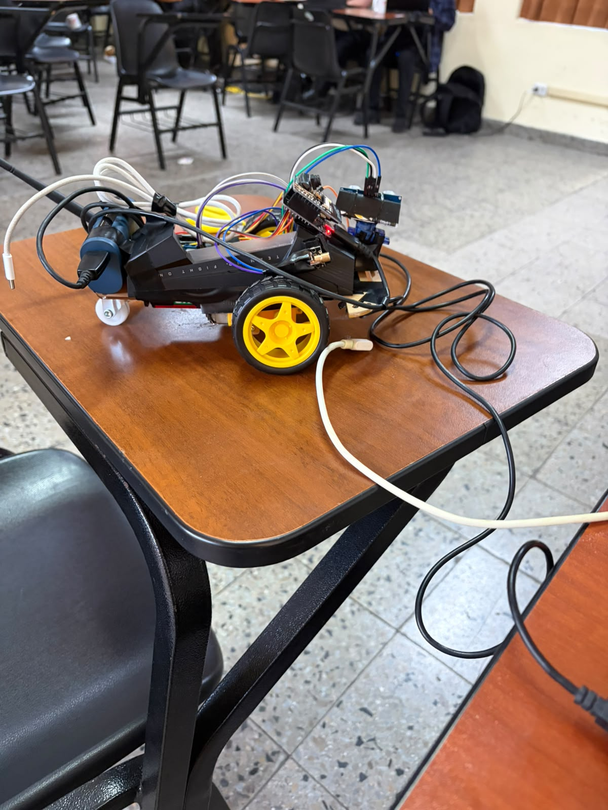
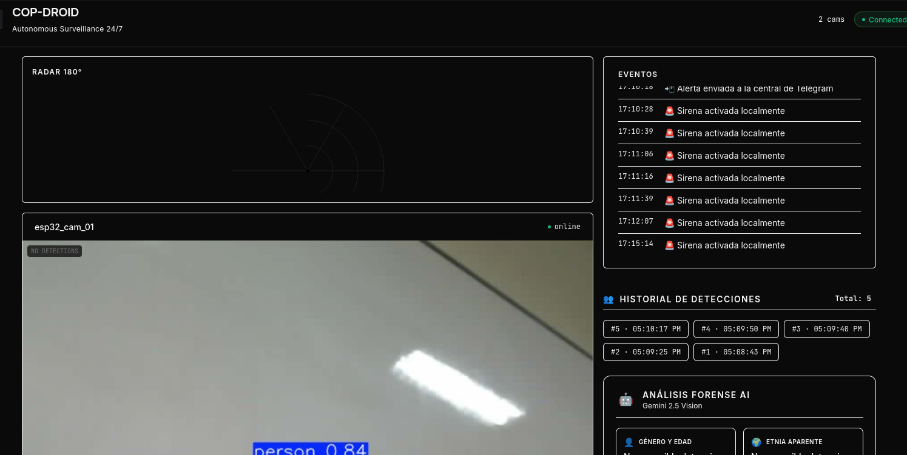
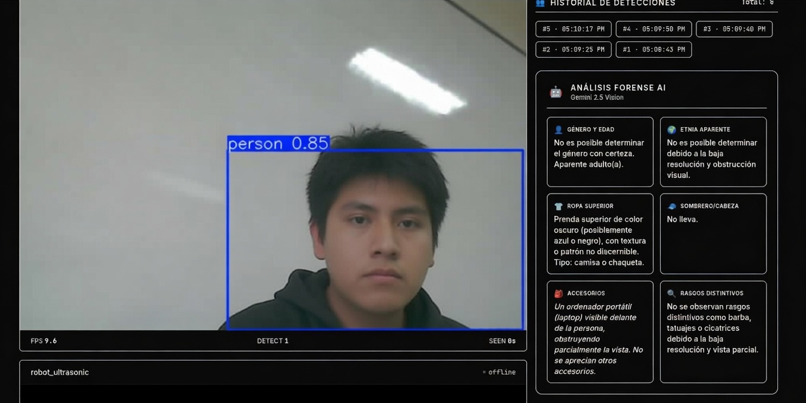
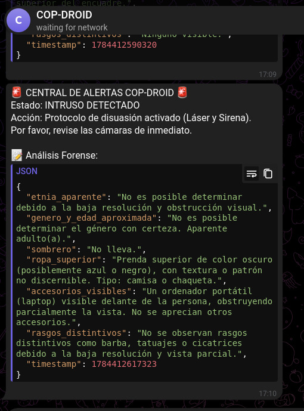

# COP-DROID


**Cop-Droid** is an autonomous sentinel robot designed to intelligently patrol ground environments. It uses ultrasonic sensors (sonar) for navigation and obstacle avoidance, while an **ESP32-CAM** runs a **YOLO**-based computer vision model on the server side to detect people in real time.

When a person is detected, the system can execute configurable responses such as activating a signaling laser, playing an alarm, or sending an instant **Telegram** notification, enabling efficient remote supervision.

The project integrates both **passive capabilities** (continuous monitoring, autonomous navigation, environment perception) and **active capabilities** (automatic actions upon detected events), offering a low-cost intelligent surveillance solution.

Cop-Droid also includes a **web dashboard** that allows operators to view real-time robot status, performance metrics, detected events, and activity history.

### Dashboard





---

## Architecture

```
┌─────────────────────┐      WebSocket (JPEG frames)      ┌──────────────────┐
│   ESP32-CAM         │ ──────────────────────────────▶   │                  │
│   (Camera / WiFi)   │                                   │   CORE AI        │
│   firmware/cam/     │ ◀──────────────────────────────   │   (FastAPI)      │
└─────────────────────┘       "ok" acknowledgment         │   port 8000      │
                                                          │                  │
┌─────────────────────┐      WebSocket (keepalive)        │   • YOLOv8       │
│   ESP32 Engine      │ ──────────────────────────────▶   │   • MJPEG stream │
│   (Navigation)      │                                   │   • Laser ctrl   │
│   firmware/engine/  │ ◀──────────────────────────────   │   • Telegram bot │
└─────────────────────┘    "LASER_ON" / "LASER_OFF"       │   • Siren alarm  │
                                                          └────────┬─────────┘
                                                                   │
                                                    REST /devices   │   MJPEG /video/{id}
                                                                   │
                                                          ┌────────▼─────────┐
                                                          │   DASHBOARD      │
                                                          │   (React + Vite) │
                                                          │   port 5173      │
                                                          └──────────────────┘
```

---

## Tech Stack

| Layer | Technology | Version |
|-------|-----------|---------|
| **Backend** | Python 3.12+, FastAPI | 0.110.0 |
| **ASGI Server** | Uvicorn | 0.28.0 |
| **ML / Vision** | YOLOv8 (Ultralytics) | latest |
| **ML Framework** | PyTorch (CPU) | latest |
| **Image Processing** | OpenCV | 4.9.0.80 |
| **WebSockets** | FastAPI + websockets | — |
| **Audio** | mpg123 | system |
| **Package Manager** | UV (astral-sh) | — |
| **Containerization** | Docker + Compose | — |
| **Frontend** | React 18, TypeScript 5.7 | 18.3.1 |
| **Bundler** | Vite | 6.3.2 |
| **CSS** | Tailwind CSS v4 | 4.1.4 |
| **Firmware** | C++ (Arduino Core) | PlatformIO |
| **Camera** | OV2640 (ESP32-CAM) | espressif/esp32-camera 2.0.4 |
| **Navigation** | HC-SR04, Servo, L298N | — |
| **WebSocket Lib** | links2004/WebSockets | 2.4.1 |
| **Notifications** | Telegram Bot API | — |

---

## Project Structure

```
COP-DROID/
├── core-ai/                        # Python backend (FastAPI)
│   ├── main.py                     # App entry, background tasks
│   ├── config.py                   # Constants & env vars
│   ├── detector.py                 # YOLO inference engine
│   ├── models.py                   # DeviceState dataclass
│   ├── state.py                    # In-memory state
│   ├── siren.mp3                   # Alarm audio file
│   ├── routes/
│   │   ├── api.py                  # REST endpoints
│   │   ├── ws.py                   # WebSocket handler
│   │   └── stream.py               # MJPEG video stream
│   ├── Dockerfile
│   ├── docker-compose.yml
│   ├── pyproject.toml
│   └── uv.lock
│
├── dashboard/                      # React + TypeScript frontend
│   ├── src/
│   │   ├── App.tsx                 # Main layout
│   │   ├── types.ts                # TypeScript interfaces
│   │   ├── api/devices.ts          # API client
│   │   ├── hooks/useDevices.ts     # Polling hook
│   │   └── components/
│   │       ├── Header.tsx
│   │       ├── DeviceCard.tsx
│   │       ├── VideoStream.tsx
│   │       ├── LaserPanel.tsx
│   │       ├── Radar180.tsx
│   │       ├── StatusCard.tsx
│   │       └── EventLog.tsx
│   ├── package.json
│   ├── vite.config.ts
│   └── tsconfig.json
│
├── firmware/
│   ├── cam/                        # ESP32-CAM firmware
│   │   ├── platformio.ini
│   │   ├── include/
│   │   │   ├── Config.h            # WiFi, server, camera pins
│   │   │   ├── Camera.h
│   │   │   └── Network.h
│   │   └── src/
│   │       ├── main.cpp
│   │       ├── Camera.cpp
│   │       └── Network.cpp
│   │
│   └── engine/                     # Navigation firmware
│       ├── platformio.ini
│       ├── include/
│       │   ├── Config.h            # WiFi, pins, nav params
│       │   ├── MotorController.h
│       │   ├── ServoController.h
│       │   ├── DistanceSensor.h
│       │   ├── ObstacleAvoidance.h
│       │   ├── WifiControl.h
│       │   └── WebSocketControl.h
│       └── src/
│           ├── main.cpp
│           ├── MotorController.cpp
│           ├── ServoController.cpp
│           ├── DistanceSensor.cpp
│           ├── ObstacleAvoidance.cpp
│           ├── WifiControl.cpp
│           └── WebSocketControl.cpp
│
└── README.md
```

---

## Prerequisites

| Tool | Version | Purpose |
|------|---------|---------|
| Python | ≥ 3.12 | Core AI backend |
| UV | latest | Python package manager |
| Node.js | ≥ 18 | Dashboard |
| npm | ≥ 9 | Dashboard dependencies |
| PlatformIO CLI | latest | Firmware build & upload |
| Docker (optional) | latest | Containerized backend |

Install **UV**:
```bash
curl -LsSf https://astral.sh/uv/install.sh | sh
```

Install **PlatformIO CLI**:
```bash
pip install platformio
```

---

## Setup & Running

### 1. Core AI (Backend)

**Option A — Local:**
```bash
cd core-ai
cp .env.example .env    # Edit with your TELEGRAM_URL if needed
uv sync
uv run uvicorn app.main:app --host 0.0.0.0 --port 8000 --reload
```

**Option B — Docker:**
```bash
cd core-ai
docker compose up --build
```

The API will be available at `http://localhost:8000`.

### 2. Dashboard (Frontend)

```bash
cd dashboard
npm install
npm run dev
```

The Vite dev server starts at `http://localhost:5173` and proxies `/devices`, `/video`, and `/health` to the Core AI server.

**Production build:**
```bash
npm run build       # Output in dist/
npm run preview     # Preview the build
```

### 3. Firmware (ESP32)

**ESP32-CAM** (camera):
```bash
cd firmware/cam
pio run --target upload        # Uploads to /dev/ttyUSB1
pio device monitor             # Monitor serial at 115200 baud
```

**ESP32 Engine** (navigation):
```bash
cd firmware/engine
pio run --target upload        # Uploads to /dev/ttyUSB0
pio device monitor
```

> **Note:** Serial ports may differ on your system. Edit `upload_port` in each `platformio.ini` if needed.

---

## Configuration

### Environment Variables (`core-ai/.env`)

| Variable | Default | Description |
|----------|---------|-------------|
| `APP_NAME` | `Cop Droid` | Application display name |
| `APP_VERSION` | `0.1.0` | Version string |
| `TELEGRAM_URL` | — | Full Telegram `sendMessage` URL with bot token & chat ID |

### Firmware — WiFi & Server (`Config.h` in both `cam/` and `engine/`)

| Setting | Default |
|---------|---------|
| `WIFI_SSID` | `"Abaddon Team"` |
| `WIFI_PASS` | `"okidokie789"` |
| `SERVER_HOST` | `"192.168.0.101"` |
| `SERVER_PORT` | `8000` |
| `DEVICE_ID` (cam) | `"esp32_cam_01"` |
| `DEVICE_ID` (engine) | `"robot_ultrasonic"` |

### Firmware — Navigation Parameters (`engine/include/Config.h`)

| Parameter | Value | Description |
|-----------|-------|-------------|
| `SAFE_DISTANCE_CM` | 30.0 | Obstacle detection threshold |
| `BACKUP_MS` | 350 | Reverse duration on obstacle |
| `TURN_90_MS` | 650 | 90° turn duration |
| `TURN_180_MS` | 1300 | 180° turn duration |
| `SERVO_CENTER_ANGLE` | 90 | Center servo position |
| `SERVO_LEFT_ANGLE` | 30 | Left scan position |
| `SERVO_RIGHT_ANGLE` | 150 | Right scan position |
| `SCAN_SAMPLES` | 3 | Median filter samples |
| `HYSTERESIS_CM` | 10.0 | Direction change hysteresis |

### Core AI Runtime Config (`core-ai/config.py`)

| Parameter | Default | Description |
|-----------|---------|-------------|
| `STALE_OFFLINE_SECONDS` | 5 | Device marked offline after inactivity |
| `STALE_REMOVE_SECONDS` | 300 | Device purged after this time |
| `LASER_TIMEOUT` | 5.0s | Laser stays on after last detection |
| `YOLO_MODEL` | `yolov8n.pt` | YOLO model file |

### Hardware Pinout

| Component | ESP32-CAM | ESP32 Engine |
|-----------|-----------|--------------|
| Camera | AI Thinker (OV2640) | — |
| Trigger (HC-SR04) | — | GPIO 5 |
| Echo (HC-SR04) | — | GPIO 18 |
| Servo | — | GPIO 13 |
| Laser | — | GPIO 14 |
| Motor IN1 | — | GPIO 25 |
| Motor IN2 | — | GPIO 26 |
| Motor IN3 | — | GPIO 32 |
| Motor IN4 | — | GPIO 27 |
| Upload port | `/dev/ttyUSB1` | `/dev/ttyUSB0` |

---

## API Endpoints

| Method | Path | Description |
|--------|------|-------------|
| `GET` | `/` | API index with docs link |
| `GET` | `/health` | Health check (`{"status": "ok"}`) |
| `GET` | `/devices` | Device list with status, laser state |
| `GET` | `/video/{device_id}` | MJPEG video stream |
| `WS` | `/ws/{device_id}` | WebSocket for device frames / commands |

---

## Operation Flow

1. **ESP32-CAM** captures JPEG frames at ~20 FPS and sends them via WebSocket binary messages to the Core AI server.
2. **ESP32 Engine** runs the obstacle avoidance state machine (`FORWARD → BACKUP → SCAN → DECIDE → TURN → FORWARD`), sends keepalive messages via WebSocket, and listens for `LASER_ON` / `LASER_OFF` commands.
3. **Core AI** receives frames from the camera, runs YOLOv8 inference to detect persons (class 0), annotates the frame, and stores it for streaming. When a person is detected, it:
   - Sends `LASER_ON` to the engine's WebSocket (turns on for 5 seconds)
   - Plays `siren.mp3` via `mpg123`
   - Sends a Telegram notification (if `TELEGRAM_URL` is configured)

   

4. **Dashboard** polls `/devices` every 2 seconds and displays camera streams, radar view, laser status, and event logs in real time.

---

## License

MIT
